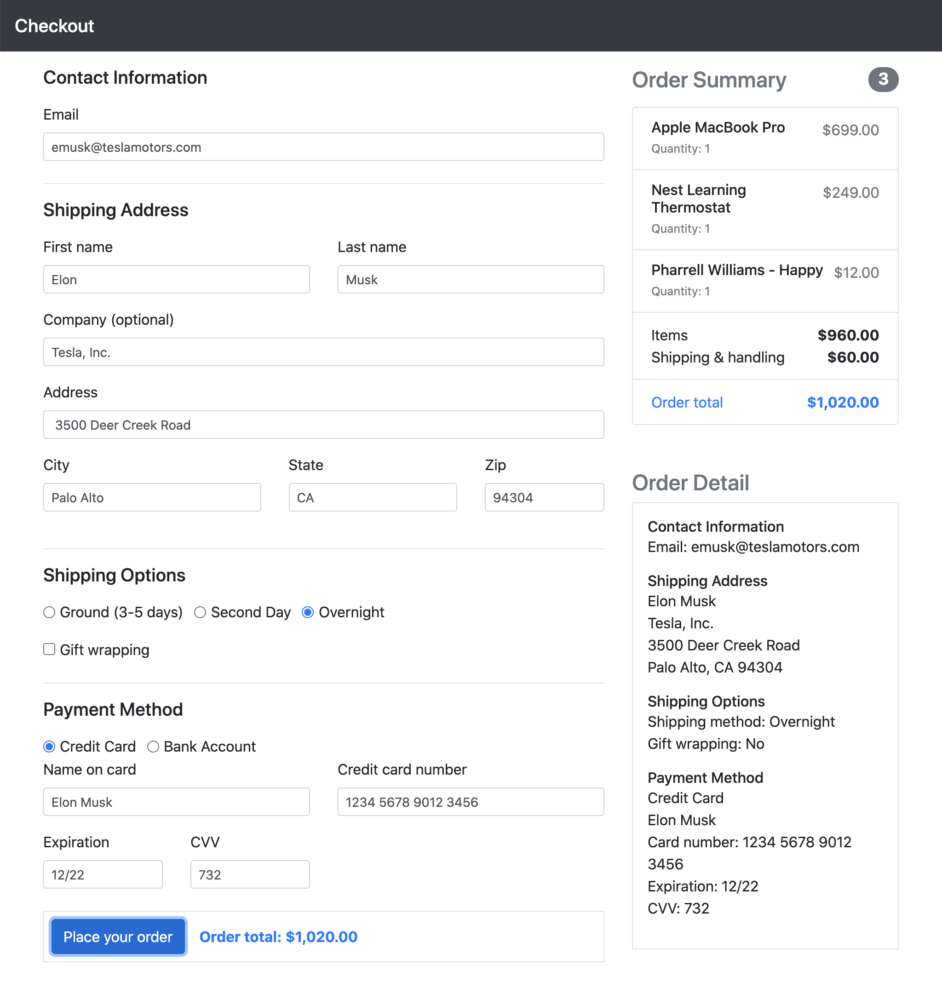

# Checkout Form | React Hook Form

Checkout form using React Hook Form.



## Getting Started

Execute the following commands to build and run the example.

```bash
$ yarn
$ yarn start
```

Now point your browser to http://localhost:3000/.
